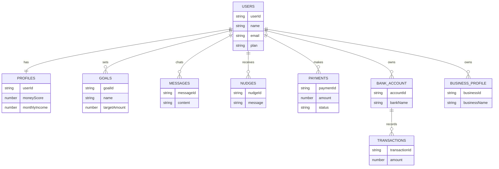

# 🚀 FinWise AI

**FinWise AI** is an AI-powered personal finance web application built with Next.js and Firebase for Indian users. It helps in financial planning, tax optimization, investment analysis, and provides smart AI-based financial advice.

---

## 🌐 Live Demo

👉 [Click here to view live project](https://fin-wise-ai-two.vercel.app/)

---

## ✨ Features

* 🔐 Authentication (Google OAuth + Email)
* 📊 FIRE Calculator (Retirement Planning)
* 💰 Tax Wizard (Old vs New Regime)
* 📈 Mutual Fund X-Ray (XIRR, Overlap)
* 🧠 Money Health Score
* 🎯 Goals Tracking System
* 🤖 AI Chatbot (Claude API, Hinglish)
* 🔔 Smart Nudges (Reminders)
* 📱 PWA + SEO Optimized

---

## 🛠️ Tech Stack

* Frontend: Next.js, Tailwind CSS
* Backend: Serverless APIs
* Database: Firebase Firestore
* Auth: NextAuth.js
* AI: Claude API
* Payments: Razorpay

---

## 📂 Database Collections

```
users/
profiles/
goals/
chats/{userId}/messages/
nudges/
payments/
bank_accounts/
transactions/
business_profiles/
```

---

## 🧠 Database Design Explanation

The system is divided into 3 major layers:

### 1. User Layer

Stores authentication and basic user info.

### 2. Financial Layer

Handles personal + business finance:

* Profiles
* Bank Accounts
* Transactions
* Goals

### 3. Interaction Layer

Handles system interaction:

* Messages (AI chat)
* Nudges (notifications)
* Reports

---

## 🔗 Relationships

* Users → Profiles (**1:1**)
* Users → Goals (**1:N**)
* Users → Messages (**1:N**)
* Users → Nudges (**1:N**)
* Users → Payments (**1:N**)
* Users → Bank Accounts (**1:N**)
* Bank Accounts → Transactions (**1:N**)
* Users → Business Profiles (**1:N**)

---

## 📊 ER Diagram



---

# 📘 Project Overview Analysis

## 🔍 Project Overview (Simple)

FinWise AI is a comprehensive personal finance management web app that acts as an AI-powered financial advisor for Indian users. It provides tools like FIRE planning, tax optimization, mutual fund analysis, money health scoring, goal tracking, and AI chat support using Claude AI.

---

## 🚀 Detailed Features & Functionalities

### 🔹 Core Financial Tools

* **FIRE Calculator** → Calculates retirement corpus & SIP planning
* **Tax Wizard** → Compares tax regimes & suggests deductions
* **MF X-Ray** → Portfolio analysis, XIRR & overlap detection
* **Money Health Score** → 6-dimension financial scoring
* **Scenario Simulator** → Simulates real-life financial events
* **Goals CRUD** → Create & track financial goals

---

### 🤖 AI Features

* AI Chatbot using Claude AI (Hinglish + English)
* Personalized financial advice
* Conversation history stored

---

### 👤 User Management

* Google OAuth + Email Authentication
* Secure password hashing (bcrypt)
* Profile-based financial data storage
* Dashboard with real-time insights

---

### ⚙️ Technical Features

* PWA support (offline + installable)
* SEO optimized (sitemap, robots.txt)
* Mobile responsive UI
* Security headers (XSS, HSTS, CSP)

---

## ⚙️ System Workflow

1. User registers/login
2. Profile created in Firestore
3. User enters financial data
4. Tools calculate (FIRE, Tax, MF, Score)
5. Results stored in profile
6. AI chatbot provides advice
7. Goals tracked and updated
8. Dashboard shows insights
9. Nudges generated automatically

---

## 🧠 Database Design Reasoning

* **NoSQL (Firestore)** → flexible schema for financial data
* **Document structure** → ideal for storing JSON results
* **Real-time updates** → live dashboard experience
* **Scalability** → serverless architecture
* **Subcollections** → efficient chat storage
* **Regional hosting** → low latency (India region)

---

## ⚠️ Assumptions

* Users are Indian residents
* Currency is INR
* Free tier available
* AI responses are real-time
* Data stored securely in Firebase
* Based on FY 2025-26 tax rules

---

## 🎯 Hackathon Demo Flow

1. Landing page
2. Login
3. Dashboard
4. FIRE calculator
5. Tax wizard
6. AI chatbot
7. Goals creation
8. Scenario simulation

---


## 📜 License

This project is licensed under the **MIT License**.

Copyright (c) 2026 FinWise AI — Built by Sumit Kumar & Mehak Singhal, KIIT University, Bhubaneswar

## 📧 Support
Sumit: [email](mailto:sumitranjanhisu@gmail.com)· Mehak: [email](mailto:singhalmehak04@gmail.com)

---


### ⚠️ SEBI Disclaimer

FinWise AI is a financial technology platform providing AI-generated educational content and financial planning tools. It does not provide investment advice as defined under SEBI (Investment Advisers) Regulations, 2013. All information is for educational purposes only. Mutual fund investments are subject to market risks. Past performance is not indicative of future returns. Please read all scheme-related documents carefully. Consult a SEBI-registered investment adviser before making any investment decisions.

---

Permission is hereby granted, free of charge, to any person obtaining a copy
of this software and associated documentation files (the "Software"), to deal
in the Software without restriction, including without limitation the rights
to use, copy, modify, merge, publish, distribute, sublicense, and/or sell
copies of the Software, and to permit persons to whom the Software is
furnished to do so, subject to the following conditions:

The above copyright notice and this permission notice shall be included in all
copies or substantial portions of the Software.

---

### Disclaimer of Warranty

THE SOFTWARE IS PROVIDED "AS IS", WITHOUT WARRANTY OF ANY KIND, EXPRESS OR
IMPLIED, INCLUDING BUT NOT LIMITED TO THE WARRANTIES OF MERCHANTABILITY,
FITNESS FOR A PARTICULAR PURPOSE AND NONINFRINGEMENT. IN NO EVENT SHALL THE
AUTHORS OR COPYRIGHT HOLDERS BE LIABLE FOR ANY CLAIM, DAMAGES OR OTHER
LIABILITY, WHETHER IN AN ACTION OF CONTRACT, TORT OR OTHERWISE, ARISING FROM,
OUT OF OR IN CONNECTION WITH THE SOFTWARE OR THE USE OR OTHER DEALINGS IN THE
SOFTWARE.
